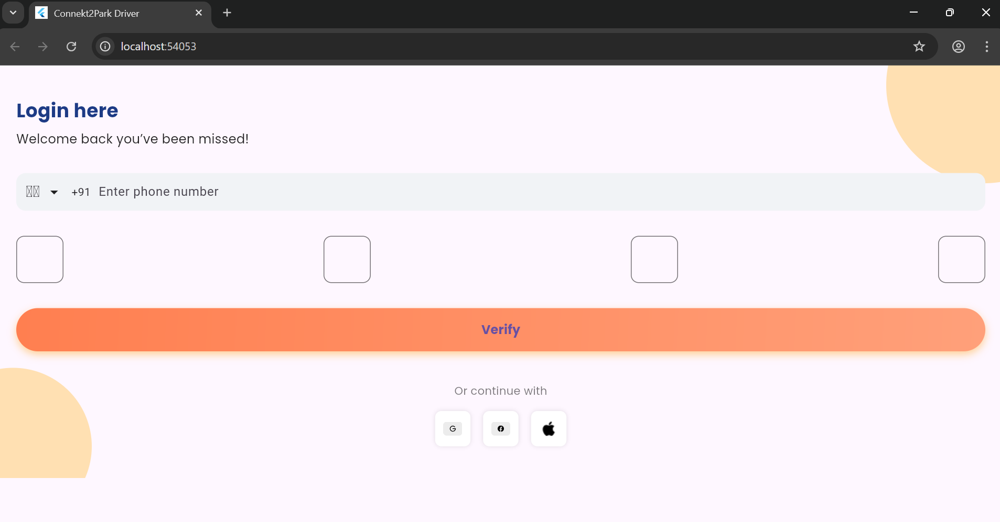
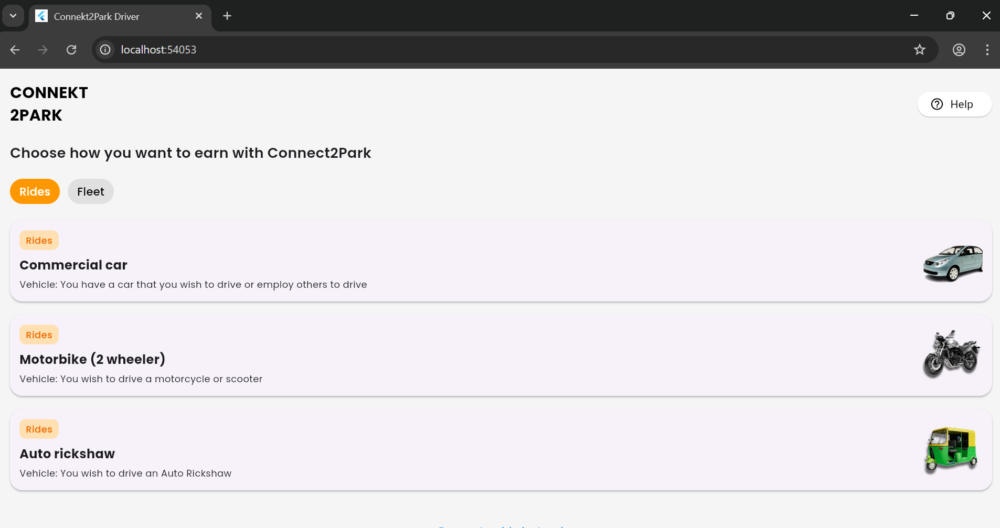
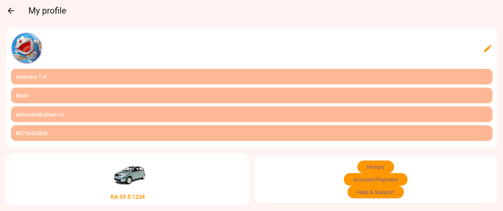

# 🚗 Driver-Side Smart Parking App

A Flutter-based mobile application designed for drivers to **book, track, and manage parking slots** in real time.  
This is the **driver-side module** of a smart parking system project.

---

## 📌 Overview
Parking in urban areas is a major challenge. Drivers often waste time searching for parking slots and face inconvenience in managing their bookings.  
This project solves that problem by providing a **simple and intuitive app** that lets drivers:
- Find and book available parking slots
- Upload their driving license for verification
- Navigate between different sections like profile, booking history, and location

---

## ✨ Features
- 🔐 **User Authentication** – Login/Signup for drivers
- 🅿️ **Parking Slot Booking** – Reserve slots in advance
- 📍 **Location Selection** – Choose a parking spot easily
- 📷 **Driving License Upload** – Capture or upload a license image
- 🔄 **Navigation Flow** – Smooth transition between booking, profile, and history screens
- ⏳ **Auto Navigation** – Redirects after a short delay for better UX

---

## 🛠️ Tech Stack
- **Framework:** Flutter (Dart)
- **Backend:** Firebase / REST APIs (extendable)
- **Version Control:** Git & GitHub
- **Tools:** Android Studio / VS Code

---

## 📱 Screenshots
| Login Screen                        | Booking Screen                          | Profile Screen                          |
|-------------------------------------|-----------------------------------------|-----------------------------------------|
|  |  |  |

*(Take screenshots from your emulator, save them inside a `screenshots/` folder in your project, and rename them `login.png`, `booking.png`, `profile.png`.)*

---

## ⚡ Installation & Setup
Follow these steps to run the project locally:

1. **Clone the repository**
   ```bash
   git clone https://github.com/yourusername/driver-side-app.git
